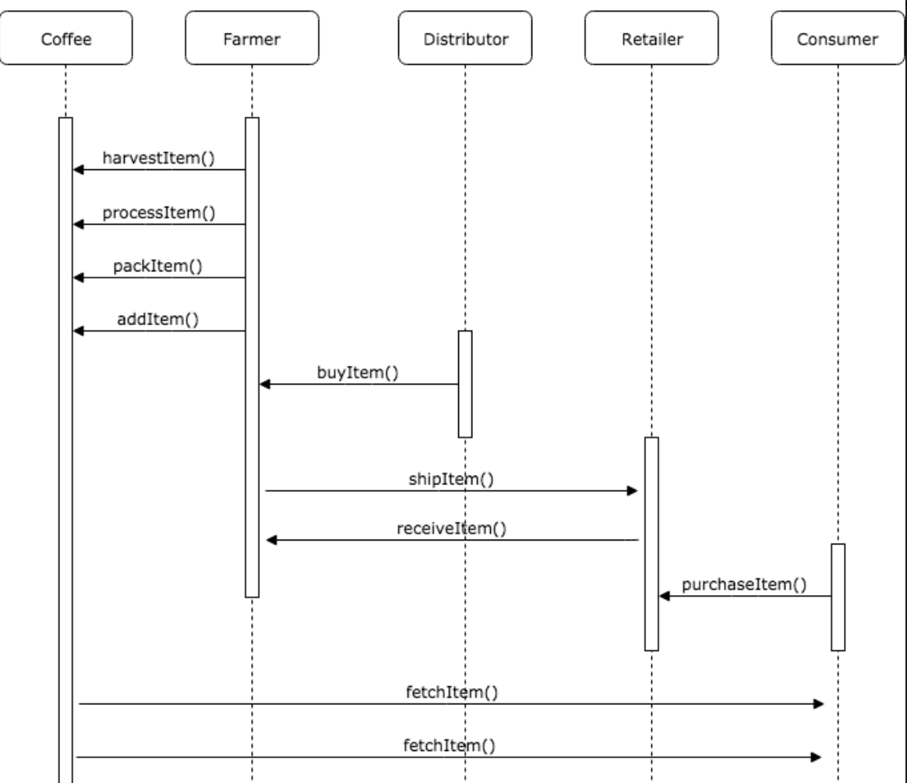

# Coffee Supply Chain

Transaction Address: 
`0xf96241402b610589fac56e4103fd11d169bd719380c1de1d7c485beb03ea28eb`

Contract Address: `0x156FD27A86437DC94deFFd1Be25919093C72EEaF`

Node version number: `11.12.0`

Truffle version number: `5.0.26`

web3 version number:`v1.0.0-beta.37`

Program Version: `1.0.0`

IPFS: Not Used

No added libraries

UML Sequence Diagram:

#updates

Added writeup, added use of farm role, and added UML diagrams.

# Writeup

This smart contract represents a coffee supply chain flow. 
Load up and serve the index.html file located in the `/src/` directory. 

To Harvest the coffee, go ahead and enter your farm information in the farm details section. You will be added as a farmer upon clicking Harvest and only your account will be able to process, pack and seel the coffee. To Process, Pack and mark the coffee as "ForSale" click the buttons respectively. 

From a second account, click the Buy button and this account is added is a distributor that can then click the "Ship" buttong to indicated that the product has been shipped. 

After the coffee has shipped, a retailer account can receive the coffee and last be purchased by a cusumer account by clicking the "Purchase" button. 

At any point after harvest, the "Fetch Item 1" and "Fetch Item 2" can retrieve inoformation about the coffee in question. 
